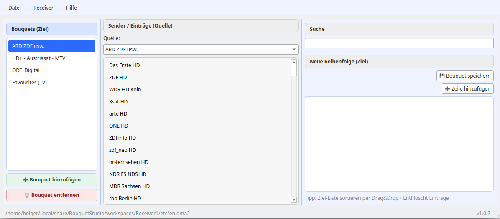

# BouquetStudio

**BouquetStudio** ist ein lokaler Enigma2‑Bouquet‑Editor (Python / PySide6),
der bewusst auf einen **expliziten Quelle → Ziel‑Workflow** setzt.

Keine automatische Magie, kein stilles Umsortieren –  
**nur das, was der Nutzer bewusst auswählt und speichert, wird übernommen.**

---


## ✨ Funktionsübersicht

### Projekt laden
- Öffnen eines Enigma2‑Projektordners über **Datei → Projekt öffnen…**
- Erwartete Struktur:
```
etc/enigma2/
├─ lamedb
├─ bouquets.tv
└─ userbouquet.*.tv
```

---

## 🧭 Bedienkonzept

### Linke Spalte – Bouquets
- Anzeige aller Bouquets
- Auswahl bestimmt das **Ziel‑Bouquet**
- Bouquets können umbenannt und neu angelegt werden
- Änderungen werden erst beim Speichern geschrieben

### Mittlere Spalte – Quelle
- Zeigt den originalen Dateiinhalt des Bouquets
- Dient ausschließlich als Quelle
- Drag erlaubt, Drop verboten
- Filter wirkt nur auf diese Liste

### Rechte Spalte – Ziel
- Arbeitsbereich
- Sender werden explizit von der Quelle hierher gezogen
- Reihenfolge per Drag & Drop
- Nur diese Liste wird gespeichert

---

## 📌 Marker / Überschriften
- Marker sind echte Enigma2‑Marker (Service‑Typ 64)
- 📌 ist nur eine UI‑Darstellung
- In der Datei wird exakt das originale Enigma2‑Format geschrieben

---

## 💾 Speichern
- Ausschließlich die rechte Liste wird gespeichert
- Das Bouquet wird vollständig ersetzt
- Leere Ziel‑Liste → kein Speichern
- Automatische Backups:
```
userbouquet.xyz.tv.bak.YYYYMMDD-HHMMSS
```

---

## 🛠️ Technik
- Python ≥ 3.10
- PySide6
- Komplett lokal
- GitHub Actions CI (Syntax & Releases)

---

## 📌 Leitgedanke

> Quelle = Referenz  
> Ziel = Entscheidung  
> Datei = Wahrheit
